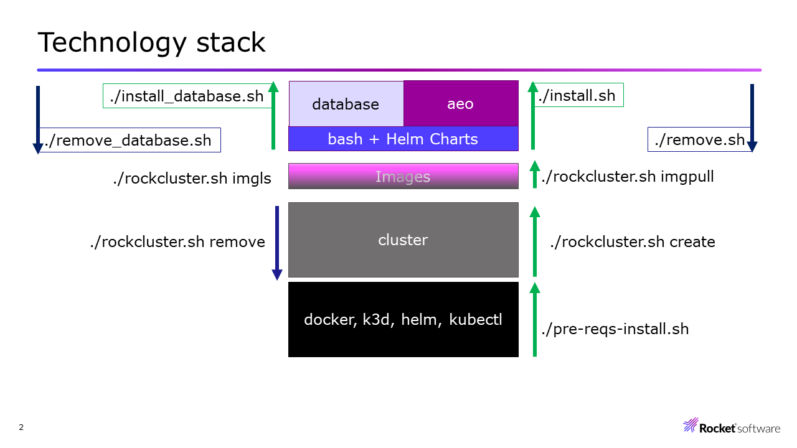

# AEO 4.3.1.x

## Introduction

- Enterprise Orchestrator 4.3.1.x - k3d installation

## Prerequisites

- Ubuntu-WSL / Ubuntu 20.04 or higher
- 16 GB / 4 CPUs
- Ubuntu WSL Installation: <https://learn.microsoft.com/en-us/windows/wsl/install-manual>

## Preinstallation actions

### Ubuntu: get installations scripts (don't use root user)

```bash
git clone https://github.com/guillermo-avendano/orchestrator.git
cd orchestrator
```

### Define variables DOCKER_USERNAME, and DOCKER_PASSWORD in "$HOME/.profile" for pulling images from "registry.rocketsoftware.com"

- Edit "$HOME/.profile", and define the variables DOCKER_USERNAME with your RCC username, and DOCKER_PASWORD

```bash
export DOCKER_USERNAME="[RCC user]@rs.com"
export DOCKER_PASSWORD="[RCC password]"
```

### Optional: add these lines to "$HOME/.profile" for facilitating the commands' typing

```bash
alias k="kubectl"
alias ta="terraform apply"
alias ti="terraform init"
```

### Refresh environment variables

```bash
source $HOME/.profile
# orchestrator folder
source ./env.sh
```

### Check versions for scheduler, clientmgr, and agent

```bash
# orchestrator folder
./rockcluster.sh imgls
```

### Variables in "./env.sh", update image versions, and AEO_URL if needed

```bash
IMAGE_SCHEDULER_NAME=aeo/scheduler
IMAGE_SCHEDULER_VERSION=4.3.1.61
IMAGE_CLIENTMGR_NAME=aeo/clientmgr
IMAGE_CLIENTMGR_VERSION=4.3.1.61
IMAGE_AGENT_NAME=aeo/agent
IMAGE_AGENT_VERSION=4.3.1.58
AEO_URL = "aeo.rocketsoftware.com"
```

### Add AEO_URL to /etc/hosts, or c:/windows/system32/drivers/etc/hosts with the IP where the custer is running, example

```bash
192.168.0.5     aeo.rocketsoftware.com pgadmin.local.net
```

## Installation sequence

1; Pre-requisites

- Install dos2unix

```bash
sudo apt install -y dos2unix
```

- Change file formats

```bash
# orchestrator folder
find . -name "*.yaml" -exec dos2unix {} \;
find . -name "*.sh" -exec dos2unix {} \;
```

- Enable scripts for execution

```bash
# orchestrator folder
chmod -R u+x *.sh
```

2; Refresh environment variables

**export KUBECONFIG="$kube_dir/cluster/.cluster-config.yaml"**

It's key for interaction between commands: kubectl, helm, etc., with the cluster.
***

```bash
source $HOME/.profile
# orchestrator folder
source ./env.sh
```

3; Install docker, k3d, helm, kubectl and terraform

```bash
# orchestrator folder
./pre-reqs-install.sh
```

4; Verify docker (more information <https://docs.docker.com/desktop/install/ubuntu/>)

```bash
docker version
```

5; Create the cluster for aeo, and pull images from registry.rocketsoftware.com

```bash
# orchestrator folder
./rockcluster.sh create
```

6; Install database, scheduler, clientmgr, and agent

```bash
# orchestrator folder
cd aeo
# install database
./install_database.sh
# install aeo
./install.sh
```

6; Enterprise Orchestrator URL: <http://aeo.rocketsoftware.com/aeo>

- user: aeo
- password: aeo

## Summary of commands

| Command | Description |
|:---|:---|
| ./rockcluster.sh on | start aeo cluster |
| ./rockcluster.sh off | stop aeo cluster |
| ./rockcluster.sh imgls | list images from registry.rocketsoftware.com |
| ./rockcluster.sh imgpull | pull images from registry.rocketsoftware.com |
| ./rockcluster.sh list | list clusters |
| ./rockcluster.sh create | create aeo cluster |
| ./rockcluster.sh remove | remove aeo cluster |
| ./rockcluster.sh debug | kubectl get/describe output of aeo's kubernetes resources |



### Install aeo

```bash
# orchestrator folder
cd aeo
# install database
./install_database.sh
# install aeo
./install.sh
```

### Remove aeo

```bash
# orchestrator folder
cd aeo
# remove aeo
./remove.sh
# remove database
./remove_database.sh
```

#### portainer: <https://<server-ip>:30779>

- user: admin
- password: <to-be-defined_12-characters_Upper-Lower-Case-and-numbers>

#### pgadmin: <http://pgadmin.local.net>

- user: <admin@admin.com>
- password: admin

server: postgresql , database=aeo, user=aeo, password=aeo
